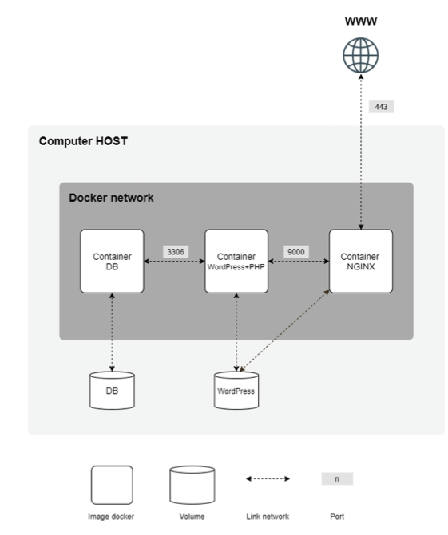

  
  <h1>Inception</h1>
  
🚀 One container is not enough, we need to go deeper

  
<pr> 

## 👀 Preview
This project aims to deepen your knowledge by making you use Docker. You will virtualize several Docker images by creating them in your new personal virtual machine.

## 👀 Objectives

This project will consist of setting up a mini-infrastructure of different services following specific rules. The whole project is to be done in a virtual machine. To do so, you will have to use docker-compose.
Each Docker image will have to have the same name as the concerned service.
Each service must run in a dedicated container.
For performance reasons, the containers will have to be built under either Alpine Linux with the penultimate stable version or Debian Buster.
Also, they should each have their own Dockerfile written by you. The Dockerfiles will be called in your docker-compose.yml file by your Makefile. You will have to build yourself the Docker images you will use. It is of course forbidden to take ready-made ones, as well as to use services such as DockerHub (Alpine and Debian being excluded from this rule).
So you will have to set up :
- A Docker container containing NGINX with TLSv1.2 or TLSv1.3 only.
- A Docker container containing WordPress + php-fpm (installed and configured) only without nginx.
- A Docker container containing MariaDB only without nginx.
- A volume containing your WordPress database.
- A second volume containing the files of your WordPress site.
- A docker-network that will link your containers.

Your containers will have to restart in case of a crash.

 Two users will be present in your WordPress database, one of them being the Admin account. The username of the Admin should not include "admin" or "Admin" (examples: admin, administrator, administrator, admin-123, etc. ...).
For readability reasons, your domain name should be configured to point to your local IP address.
This domain name will be login.42.fr. Again, you will use your login.
For example, if your login is wil, wil.42.fr will redirect to the IP address pointing to the wil website.
Here is an example, in the form of a diagram, of what you will need to set up:

  
<pr> 

<!--badges : https://badge42.vercel.app-->
